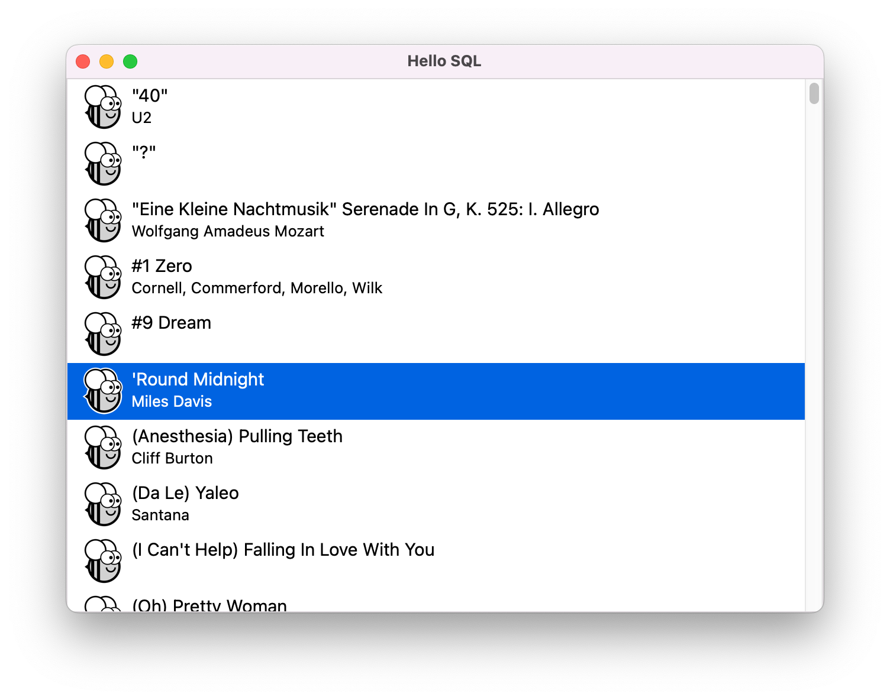

# BeeWare & sqlite3

**This cross-platform app was generated by** [Briefcase](https://github.com/beeware/briefcase) **- part of**
[The BeeWare Project](https://beeware.org/). **If you want to see more tools like Briefcase, please
consider** [becoming a financial member of BeeWare](https://beeware.org/contributing/membership).

Proof of concept [BeeWare](https://beeware.org/) app using [sqlite3](https://docs.python.org/3/library/sqlite3.html) based off of [Beeware Tutotial](https://docs.beeware.org/en/latest/tutorial/tutorial-1.html).




## Dev setup

```sh
pip install -r requirements.txt
briefcase dev
```

## Build Mac app

```sh
breifcase create  # only run once?
briefcase update
briefcase build
```

## Build iOS app

```sh
briefcase create iOS  # only run once?
briefcase update iOS
briefcase build iOS
briefcase run iOS
```

## Build Andriod app

```sh
briefcase create android  # only run once?
briefcase update android
briefcase build android
briefcase run android
```
